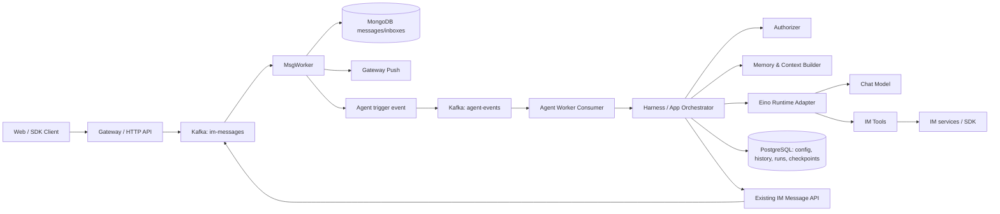

# Nonoka IM Agent 架构与实现设计

> 状态：讨论稿，作为后续分模块实现的设计基线。本文优先覆盖可演示、可维护的 MVP，不以完整企业 IM 或通用 Agent 平台为目标。

## 1. 目标与范围

在现有 Nonoka IM 上增加可用的 Agent 能力，同时保留现有消息链路和服务边界。第一阶段目标：

- 用户可以和 Agent 私聊，也可以在群聊中 `@Agent` 触发它。
- Agent 以明确的 Agent 身份运行，同时保留真实发起者身份。
- Agent 只能使用被配置的工具，并且只能访问发起者本来有权访问的 IM 资源。
- Agent 能通过现有消息服务回复，消息仍走现有 Kafka、MsgWorker、MongoDB 和 Gateway 推送链路。
- 支持多轮对话历史；需要人工确认的操作支持 Eino Interrupt/Resume。
- 有独立的 Agent Worker 进程，能独立启动和扩容。

暂不以以下内容为首期目标：复杂多租户工作区、通用插件市场、多 Agent 规划、自动长期记忆、独立向量数据库、MinIO 迁移、细粒度合规审计平台。它们可在有具体需求后演进。

### 实现原则：优先复用 Eino 和 eino-ext

实现 Agent 模块时，先检查 Eino 核心框架、官方 `eino-ext` 组件和官方示例是否已有可直接组合或适配的能力，再决定是否编写项目代码。能用 Eino/eino-ext 完成的 Agent 执行循环、模型/Embedding/Retriever/Indexer/文档处理适配、ToolsNode、middleware、callbacks、流式处理和 Interrupt/Resume，就优先使用现成实现，不重复造轮子。项目代码集中处理 Nonoka 特有的 IM 事件、业务策略、资源授权、数据持久化接线和产品交互。

新增自定义组件前，应在实现说明或 PR 中写明检查过的 Eino/eino-ext 能力、现有方案不适用的原因，以及自定义代码负责的最小范围。依赖具体 API 前查看当前项目锁定的 Eino/eino-ext 版本和对应文档/示例，避免照抄其他版本的接口。

## 2. 现有系统基础

当前主链路为 Gateway → Kafka → MsgWorker。MsgWorker 负责生成消息 ID/会话序号、持久化消息并推送在线用户。PostgreSQL 存储用户、群、群成员和会话摘要；Redis 用于在线会话、序号、成员缓存等；MongoDB 存储消息、收件箱和附件。项目已有 Go SDK、Kafka 生产/消费、JWT 用户认证和独立 MsgWorker 入口。

Agent 应复用这些能力，而不是建立平行 IM 存储或直接操作消息集合。Agent 回复通过现有 IM API/SDK 提交，确保仍然经过原有消息处理链路。

在 Agent 工具开放前，需要优先补齐两项访问控制：群消息发送/拉取路径要验证用户是否属于目标群；文件下载目前主要依赖不可猜测的 file ID，应改成带身份和资源权限校验的访问方式。Agent 执行不能绕过这两条服务端检查。

## 3. 架构总览

首期作为独立进程部署，但保持单体仓库、单个 Agent Worker，不提前拆多个微服务。



Agent Worker 可以与 MsgWorker 共用配置和基础设施，但 Agent 推理必须异步执行，不阻塞 IM 消息持久化、offset 提交或 Gateway 推送。

### 3.1 消息触发事件

Agent 触发事件是“某条已持久化消息可供 Agent 评估”的内部事件，不是面向客户端的新消息类型。事件至少应有：

- `event_id`：稳定的唯一 ID，用于消费幂等。
- `msg_id`、`topic`、`sender_id`、`msg_type`、`timestamp`。
- `mentioned_agent_ids` 或可供 Harness 判断触发条件的必要字段。
- 可选的 schema/version 字段，便于演进。

尽可能只发送消息引用和必要元数据，由 Agent Worker 根据访问权限重新读取消息内容，避免内部事件携带不必要的敏感数据。若为了首版简单在事件内携带消息体，也必须限制 Kafka 访问、日志脱敏并避免把正文打进普通日志。

触发规则首期固定为：Agent 私聊消息，或群消息明确 `@` 该 Agent。不要默认让 Agent 读取或响应所有群消息。收到自己产生的 Agent 回复时跳过触发，避免循环。

### 3.2 Kafka 投递和幂等

Kafka 按至少一次投递来设计。Agent Worker 以 `event_id`（或等价的 `msg_id + agent_id` 唯一键）建立运行记录，重复事件不重复创建副作用。建议同一个 IM topic 的事件使用相同 Kafka key，以保持会话内的触发顺序；不同会话可并行执行。

事件由 MongoDB transactional outbox 可靠发布：MsgWorker 在同一 MongoDB 事务中写入 IM 消息和 `agent_event_outbox` 记录，后台 relay 再将记录发布到 Kafka 并标记为 `published`。relay 使用租约和有限重试，进程在发布后、标记前崩溃时可能重复发布；Agent Worker 以 `event_id` 幂等，因此不会重复运行或回复。需要 MongoDB replica set（或 sharded cluster）提供事务支持。outbox 行保留用于排查和审计，后续可增加清理策略。

Agent Worker 不应提交 IM 消息 topic 的 consumer offset 来等待模型响应。Agent 触发事件由独立 topic/consumer group 处理，模型超时、重试和 DLQ 都与 IM 正常消息消费隔离。

## 4. 代码模块与依赖方向

建议在同一 Go 模块内显式区分 Harness 和 Eino Runtime。首期不把 Runtime 另拆成网络服务。

```text
cmd/agent-worker/                 # 进程入口、配置、生命周期和依赖装配
internal/agent/
  app/                            # Harness：触发处理、授权、会话编排、回复提交
  domain/                         # Agent、Run、Session、事件等项目自身类型/接口
  runtime/                        # Runtime 接口和 Eino 无关的输入/事件/结果类型
  eino/                           # Eino Agent/Runner、模型、工具注册、事件转换
  tools/                          # IM 搜索、文件读取、发送消息等受控工具
  memory/                         # 历史加载、上下文窗口/摘要策略
  store/                          # PostgreSQL repositories、Eino CheckPointStore 适配器
  consumer/                       # Kafka agent-events 消费与幂等处理
```

允许合并小包，不要求为了目录齐全先造空抽象。重要的是依赖方向：

1. `consumer` 调用 `app`，不直接调用 Eino 或 IM 数据库。
2. `app` 依赖项目定义的 `runtime`、存储、授权、消息发送等接口。
3. `eino` 实现项目 `runtime` 接口，并在适配层内部使用 Eino 类型。
4. `tools` 调用已有 IM 服务接口或 SDK；工具通过执行上下文取得可信调用者信息并在服务端检查权限。
5. `store` 实现业务数据接口和 Eino CheckPointStore 接口；外部包不应依赖存储细节。

尽量不让 `adk.AgentEvent`、Eino Message 等框架类型泄漏到 Harness 之外。以后升级 Eino 或替换模型时，应主要改动 `internal/agent/eino` 和适配器，而不是 Kafka 消费、IM 权限和业务会话。

### 各模块职责

| 模块 | 负责 | 不负责 |
| --- | --- | --- |
| Harness (`app`) | 验证触发条件和运行主体、授权、Agent 配置解析、加载上下文、启动/恢复 Runtime、保存运行结果、提交 IM 回复 | 实现模型循环或直接拼接底层 Eino 状态 |
| Eino Runtime (`eino`) | 初始化 ChatModel、ADK Agent/Runner、Tools、middleware/callbacks；消费 AgentEvent；Interrupt/Resume；转换框架事件 | 决定用户能否访问某个群/文件，定义 IM 产品权限 |
| Tools (`tools`) | 将 IM 功能包装成有 schema 的 Eino Tool；做参数校验、权限上下文传播和超时控制 | 直接信任模型传入的 user ID、绕过服务端 ACL 读数据库 |
| Memory (`memory`) | 加载多轮历史、裁剪上下文、可选摘要 | 保存审批恢复位置（由 checkpoint 负责） |
| Store (`store`) | Agent 配置、Agent Session/Turn、Run、审批状态、checkpoint 持久化 | 将所有 Eino 内部类型作为产品数据模型 |
| Consumer (`consumer`) | Kafka 解码、并发、重试/DLQ、幂等入口 | 同步等待用户审批或占用 IM consumer |

## 5. Agent 身份、分享与资源授权

### 5.1 身份必须区分

一次运行至少包含：

- `agent_id`：使用哪个 Agent 配置、提示词和允许的工具。
- `owner_user_id`：谁创建/管理了 Agent。
- `actor_user_id`：这次运行的实际调用者。
- `topic`/`group_id`：本次会话和资源上下文。
- 可选 `trigger_msg_id`、`run_id`、`device_id` 等追踪信息。

不能把 Agent 创建者当成所有运行的资源访问主体。否则共享 Agent 会形成 confused deputy：被分享者可能借创建者身份访问私人数据。

### 5.2 可见范围和资源范围

Agent 的分享策略首期可用数据库枚举表示：

- `private`：只有 owner 可调用。
- `selected_users`：指定的用户可调用。
- `group`：指定群成员可调用。

分享 Agent 仅授予“调用 Agent”的能力，不自动授予其创建者的数据访问权限。每次工具访问采用权限交集：

```text
有效访问 = actor 当前对 IM 资源的权限
         ∩ Agent 已启用工具允许访问的资源类型/范围
         ∩ 本次会话 topic 的范围
```

例子：群成员可在群里 `@Agent`，Agent 可搜索该群内且调用者有权看的消息；它不能因此读取 Agent owner 的私人文件。读取文件使用 file ID，但要通过当前调用者和资源关系鉴权，不能允许模型传任意路径、Mongo collection 或对象存储 key。

### 5.3 授权组件选择

第一阶段使用 PostgreSQL 中的 Agent access policy/ACL 表，并由统一 `Authorizer` 接口提供检查，避免散落硬编码。当前角色和关系简单，额外部署授权服务会增加实现成本。

当需要组织/工作区、群组嵌套、文件夹继承、复杂用户关系后，再考虑：

- [OpenFGA](https://openfga.dev/)：适合以用户—群组—资源关系为中心的细粒度授权。
- [Casbin](https://casbin.org/)：适合在 Go 服务内嵌入 RBAC/ABAC 策略检查。

无论用哪种组件，授权都要发生在 IM 服务/工具执行边界。提示词、工具描述或 Agent middleware 本身都不是安全边界。Eino middleware 可做统一拦截、日志或审批流程，但不能替代消息服务的数据 ACL。

### 5.4 MVP 授权基线

在开放 Agent 工具前补齐：

1. P2P topic 中当前用户是参与者的校验。
2. Group topic 中当前用户是有效成员的校验，覆盖 WebSocket/HTTP 发送和拉取路径。
3. 文件读取/下载的身份和资源授权；后续支持短时签名 URL 时仍应先验证签发者的访问权。
4. `actor_user_id` 只能从验证后的 JWT/可信内部事件获得，不能接受模型参数覆盖。
5. 对群成员变更及时使缓存失效，授权失败 fail closed。

## 6. Eino Runtime、Harness 与工具调用

Eino ADK 适合作为 Runtime 的框架基础：Agent、Runner、AgentEvent 流、ChatModelAgent、Tools、middleware/callbacks、流式执行和 Interrupt/Resume。框架负责 Agent 执行机制，Harness 管项目策略和 IM 生命周期。

具体实现时应先盘点 Eino 核心和 `eino-ext`：模型与 Embedding 提供方、文件/S3 Loader、文档 Parser/Splitter/Reranker、向量数据库 Indexer/Retriever、官方工具适配器及 Skill/审批 middleware 等。优先选择成熟扩展并通过 Runtime/工具装配层接入；只有 IM 消息读取、Nonoka ACL、Agent 分享范围等产品专属逻辑由项目实现。不要仅因能力在 `eino-ext` 而非 Eino 核心仓库，就误认为需要自行重写。

每次 Run 的核心步骤：

1. Consumer 收到 Agent 触发事件，校验格式和唯一 ID。
2. Harness 加载 Agent 配置、topic 和 actor，检查 Agent 分享策略、触发条件和限流。
3. Memory 从持久化历史取所需上下文，并限制轮数/Token 规模。
4. Harness 创建不可伪造的 `RunContext`，含 `agent_id`、`owner_user_id`、`actor_user_id`、`topic`、`run_id` 和 trace 信息。
5. Runtime 将业务输入转换为 Eino 消息并调用 Runner，读取 AgentEvent；将最终回答、工具调用状态或 interrupt 转回项目类型。
6. Harness 持久化 Run/Turn 状态。完成后通过已有 IM 消息服务发回复；需要审批则记录 pending 状态并等待用户动作。

### 工具首批范围

推荐首批只做：

- `search_messages`：按当前允许的 topic、时间范围和关键词搜索消息。
- `get_conversation_context`：读取当前会话有限范围的历史。
- `read_file`：按 file ID 读取有权访问的附件/文档。
- `send_message`：向允许的当前 topic 回复。

第一批工具中，查询工具可直接执行权限检查；`send_message` 可先在群内仅限回复当前触发会话，并根据产品体验决定是否审批。添加成员、删除文件、跨群发送等改变权限或扩大影响面的工具首期不提供；以后增加时用 Interrupt/Resume 做人工确认。

模型生成的 Tool 参数是不可信输入。每个 Tool 都需做 JSON/schema 校验、资源 ID 校验、用户/群权限检查、超时和结果体积限制；错误输出注意不要泄露无权访问资源是否存在。

## 7. Interrupt/Resume 与人工审批

按 [Eino Chapter 7: Interrupt/Resume](https://www.cloudwego.io/docs/eino/quick_start/chapter_07_interrupt_resume/) 的思路，对需要批准的 Tool 调用触发中断：Eino Runner 暂停并保存运行 checkpoint，业务层向用户展示工具名和参数摘要；用户批准/拒绝后，Harness 恢复相应 checkpoint。

分工如下：

- **Harness 决定**哪些工具/参数需要审批、谁是审批者、审批是否过期、批准后是否仍有权限。
- **Eino Runtime** 使用 interrupt/resume 机制暂停/恢复工具调用，读取 AgentEvent 并转换事件。
- **Checkpoint Store** 实现 Eino 要求的存取接口，让进程重启后能读取被暂停状态；具体接口形状应以项目 pin 的 Eino 版本为准。
- **业务 Store** 保存 `run_id`、checkpoint ID、发起者、工具参数摘要/哈希、审批人、状态、创建/过期时间和一次性消费标记。

恢复时必须验证：动作属于该 Run、审批用户符合策略、Run 未过期、checkpoint 与待审批操作匹配、调用者仍有资源权限。批准记录要原子地从 pending 转为 approved/consumed，防止重复恢复。Checkpoint 是执行状态，不代替业务审批记录或会话历史。

如果首版 UI 暂时没有审批交互，可先只实现只读工具与自动回复，把审批 Tool 放在后续阶段；不要假设“Runner 已 pause”就等于已完成产品审批。

## 8. Memory 和持久化

明确区分三类数据：

| 内容 | 用途 | MVP 存储建议 |
| --- | --- | --- |
| 对话历史（Memory） | 下一轮输入的上下文 | PostgreSQL；存用户/Agent 轮次和消息引用 |
| Run/审批业务状态 | 幂等、状态展示、恢复授权 | PostgreSQL；以 run_id / event_id 建唯一约束 |
| Eino Checkpoint | Interrupt 后恢复完整执行状态 | 实现 Eino CheckPointStore 接口；初期 PostgreSQL，必要时 Redis 作临时层 |
| 长期用户记忆 | 跨会话偏好/事实 | 首期不做；有需求后再设计用户确认、查看、删除和权限 |

Eino Runner 不会自动让 IM 聊天记录成为持久 Memory。Harness 每次运行前负责加载要发送给模型的历史消息，每轮结束后负责保存新用户输入和 Agent 最终回答。初期使用“最近 N 轮 + 最大 Token 预算”，超出后简单裁剪；摘要可后续增加，并把摘要作为可重建的派生数据。

已有 IM 消息可作为用户可见聊天记录的来源，但 Agent 内部 Tool call、Tool result、interrupt 状态和重试不宜全塞进普通 IM 消息。业务侧 Agent Session/Turn/Run 表负责执行历史；实际对话消息仍可通过 IM topic 展示并关联。

长期 Memory 暂不等于向量检索。若需要保存用户偏好，应先确定何时提取、怎样纠错、用户如何查看/删除以及哪些 Agent 可见，再选关系型字段或专用记忆表。

## 9. 消息搜索、Agentic Search 与 RAG

首期以受权限约束的搜索工具开始，不先引入向量库：

1. 对消息按当前 topic、时间和 sender 等结构化条件过滤。
2. 使用已有数据库能力提供关键词搜索（PostgreSQL full-text 或 MongoDB 文本/索引方案需结合当前消息数据布局验证）。
3. Agent 可以多轮调用搜索工具，缩小时间段、改变关键词并汇总结果；这是轻量的 Agentic Search。
4. 如果真实使用中关键词搜索无法命中语义相近内容，再试 pgvector 的 embedding 检索或关键词+向量 hybrid search。

Agentic Search 与 RAG 不互斥：Agentic Search 是“如何规划并调用搜索步骤”；RAG 是“如何检索并把资料交给模型”。Agentic Search 可以调用全文搜索工具，也可以调用 Eino Retriever。Eino 提供 Retriever/Indexer/Embedding/Document 等组件接口，Eino 扩展包含多种实现；它不替应用决定 ACL 过滤、数据更新和索引一致性。

若采用 pgvector，向量查询必须在数据库查询时带上可见范围过滤，不能先全库召回再指望模型忽略越权文档。索引需保留 owner/group/topic 等授权元数据，处理删除和撤权。先对少量授权文档做验证，不将全部聊天记录默认索引。

## 10. 附件与对象存储

现有文件服务把附件 bytes 存在 MongoDB 单文档中，有单文件大小上限。首期可以保留 MongoDB，先将文件访问鉴权做正确。

当出现较大文件、文档解析、知识库批量导入或存储成本压力时，再将文件内容迁移到 MinIO/S3：

- PostgreSQL/MongoDB 保存文件 ID、owner、群/会话范围、MIME、大小、对象 key 和状态。
- MinIO 保存对象内容；客户端通过服务端鉴权后的短时 URL 或服务端代理下载。
- Eino 的 S3 文档 Loader 可接入对象，但仍需在导入前验证调用者/知识库的访问范围。

对象存储迁移不是 Agent MVP 的前置条件。

## 11. 流式回复与客户端呈现

Eino 支持流式 Runner/AgentEvent，但当前 IM Packet 协议的主要语义是完整消息，不代表已支持 Agent delta 流。首版应先在模型结束后调用现有消息 API 发完整回复，以复用可靠的存储、序号和离线同步。

后续若需要打字机效果，再设计 Agent run/status/delta/final 事件，处理在线推送、重连补拉、取消运行、重复 delta 和最终消息落库的关系。最终内容应有稳定 message ID，delta 事件不能替代正式消息持久化。

## 12. 配置、启动与可观测性

建议新增 `cmd/agent-worker`，沿用现有配置加载方式。新增配置只包含需要运维控制的内容：Kafka agent topic/group、worker 并发、重试/超时、模型提供方、默认上下文窗口、checkpoint TTL 和 Agent 启停等。模型密钥从环境变量或部署 Secret 读取，不提交到 YAML。

### 12.1 Agent Trace 设计

Trace 用于回答“一次 Agent 回复经历了什么、慢在哪里、哪个 Tool/模型步骤失败”，它是可观测性链路，不是会话 Memory，也不应成为业务状态的唯一存储。

建议采用 OpenTelemetry 作为项目统一 Trace 标准，用现有 OTel SDK/Exporter 输出 OTLP，再接 Jaeger、Grafana Tempo 或 Langfuse 等后端。Langfuse 支持直接摄入 OTLP traces：Go OTel OTLP/HTTP exporter 可直接指向 Langfuse 的 OTLP endpoint，并配置 Langfuse project 的 Basic Auth 凭据和 ingestion version header；也可以先发到 OpenTelemetry Collector，由 Collector 做 batch、重试、脱敏或转发到 Langfuse。自托管和云端的 base URL 不同，应按当前 Langfuse 部署文档配置，不把密钥写进仓库配置文件。

Eino 官方 callback 文档提供通过 callbacks 在 Runner/Agent 生命周期创建 OTel span 的做法；Eino callbacks 也能观察 ChatModel、Tool、Retriever 等组件。通用 OTel span 可以被 Langfuse 摄入；若要在 Langfuse UI 中显示更丰富的 LLM Generation 信息（模型名、input/output、token usage 等），需按其 OTel attribute/observation 约定做字段映射，并在当前 Eino callback 能力范围内采集对应数据。不要为此另造一套 Eino 执行追踪器。Eino 文档另提供 CozeLoop callback 集成；那是另一种平台接法，不是接 Langfuse 的必选依赖。首期选择一个 Trace backend 即可，后端应可通过 OTLP 配置替换。

每次 Agent 执行创建一个 Harness 根 span，并让 Eino Runtime 在这个 context 下调用 Runner。根 span 下可包含以下业务和组件子 span：

```text
agent.run                              # Harness 根 span，run_id/agent_id
├── agent.authorize                    # Agent 可见性和资源范围检查
├── agent.memory.load                  # 历史加载、裁剪/摘要耗时
├── eino.agent / eino.chat_model        # Eino callbacks 产生的执行/模型 span
├── eino.tool.search_messages           # Tool 调用及结果状态
├── eino.retriever                      # 如后续使用 RAG
├── agent.checkpoint.save_or_resume     # interrupt、checkpoint 和恢复
└── agent.reply.submit                  # 提交现有 IM 消息服务
```

跨 Kafka 边界传播 W3C `traceparent`/baggage 等必要 trace context。因为 Agent 处理是异步且可能排队很久，建议将消息生产侧 trace context 作为 Agent Run 根 span 的 **Span Link**；是否直接延续 parent trace 可按 tracing backend 的展示和采样策略决定。这样原始 IM 消息链路与稍后发生的 Agent Run 仍可关联，又不会把一个长时间异步工作错误地表现成同步请求。`event_id`、`msg_id`、`run_id` 用作关联属性；同一消息触发多个 Agent 时，每个 Agent 都有独立 run/trace。

Trace 用于查问题，不负责幂等和恢复：`agent_runs` 中持久化状态、错误类别和 `trace_id`，checkpoint 保存 Eino 恢复所需状态，OTel backend 按采样/保留期保存 spans。不要把完整会话或 Tool 大结果作为 span attribute/event 存储。

建议最小化采集并控制敏感内容：

- 可记录 `agent_id`、`run_id`、`event_id`、消息 ID、topic 类型、模型/Tool 名称、耗时、状态、错误分类、token usage 和审批结果。
- 用户 ID、topic、文件 ID 属于可关联身份/资源的数据，应按部署隐私策略决定是否写入 trace；可用内部 ID、哈希或受控属性，并限制 Trace UI 访问。
- 默认不记录 prompt 正文、私聊/群聊消息全文、模型完整回复、Tool 参数原文、附件内容和凭据。调试样本需经显式脱敏、短保留期和访问控制。
- OTel attribute 命名和错误状态保持稳定，避免把高基数正文、动态 URL 或完整参数放进指标标签；Trace 与 Metrics 分开设计。

### 12.2 日志、指标和限额

Eino callbacks 可接入运行 Trace/模型/工具阶段观测；Harness 自己补充授权、Memory、队列等待、checkpoint 和回复提交等业务 span。业务日志和指标至少关联 `run_id`、`event_id`、`agent_id`、模型耗时、Tool 名称和状态、token 用量（若模型适配器提供）、重试次数、interrupt/approval 结果。日志与 Trace 都要遵守上述脱敏边界。

需要限制每个 Agent 的最大轮数、总耗时、模型输出长度、工具超时和并发数，避免异常 Agent Run 占满 Worker。优先使用 Eino/模型适配器已有能力，业务侧仅补足产品所需的边界控制。

## 13. 建议的数据实体

首期可按需精简，概念上需要以下实体：

- `agents`：owner、名称、系统指令、模型配置引用、enabled 状态、可见策略。
- `agent_access`：Agent 对 user/group 的调用授权；private 可由 owner 关系表达。
- `agent_tools`：Agent 启用的工具名和受控配置，不存任意代码。
- `agent_sessions`：agent_id、topic、actor/会话关联、最近活动时间。
- `agent_runs`：trigger event 唯一键、状态、checkpoint ID、开始/结束时间、错误分类。
- `agent_turns`：输入/最终输出或关联 IM msg_id；按隐私策略控制原文保存。
- `agent_approvals`：待审批操作、审批主体、状态、过期时间、一次性消费字段。

首版可先只支持系统预置的一个 Agent，不开放管理 UI；但数据库主键和运行上下文仍应带 `agent_id`，避免以后从单 Agent 迁移到多 Agent 时重做全部关联。

## 14. 分阶段实现顺序

### 阶段 0：IM 权限基线

- 校验 P2P topic 参与者及 group topic 成员。
- 修复 HTTP/WebSocket 发送、拉取等入口的一致性。
- 给文件读取/下载增加用户与资源授权。
- 增加共享的 Authorizer 边界和针对越权访问的集成测试。

### 阶段 1：单 Agent 闭环

- 增加 Agent event schema/topic 和独立 `cmd/agent-worker`。
- 暂用一个预置 Agent，私聊或 `@` 触发。
- Harness 与 Eino Runtime 显式分层。
- 提供 `search_messages`（先关键词）、`get_conversation_context`、`send_message`。
- 完整生成后经现有 IM API 回复；按 event ID 幂等。

### 阶段 2：上下文与运行状态

- PostgreSQL 保存 Agent Session/Turn/Run。
- 加最近轮次和 token/字符上限。
- 增加超时、重试、DLQ、并发限制和 Eino callbacks 观测。

### 阶段 3：共享范围和审批

- 增加 private/user/group Agent 可见策略。
- 工具执行时按 actor 权限和资源 topic 验证。
- 对选定的副作用工具接 Eino Interrupt/Resume、持久化 checkpoint 和审批状态。

### 阶段 4：按实际需求增强检索和文件

- 用真实搜索问题比较关键词搜索与语义搜索。
- 有价值时在 PostgreSQL 上试 pgvector/hybrid search。
- 文档体积/解析需求明确后再迁 MinIO/S3，并接入 Eino Loader/Parser/Indexer/Retriever。

### Worker 本地运行配置

Agent Worker 需要单独启动，并连接 PostgreSQL、MongoDB、Kafka 和 IM HTTP 服务。模型密钥通过环境变量注入，不写入配置文件：

```env
POSTGRES_DSN=host=127.0.0.1 user=postgres password=root dbname=nonoka_im port=5432 sslmode=disable
MONGODB_URI=mongodb://127.0.0.1:27017
MONGODB_DATABASE=nonoka_im
KAFKA_BROKERS=127.0.0.1:9092
AGENT_ID=1
AGENT_BOT_ID=123
AGENT_BOT_TOKEN=<该 Bot 用户的有效 JWT>
OPENAI_API_KEY=<OpenAI-compatible API key>
OPENAI_BASE_URL=https://api.deepseek.com/v1
OPENAI_MODEL=deepseek-chat
AGENT_EVENTS_TOPIC=agent-events
AGENT_EVENTS_GROUP=nonoka-agent-worker
AGENT_WORKERS=2
AGENT_MAX_RETRIES=2
AGENT_MAX_CONTEXT_CHARS=12000
IM_HTTP_URL=http://127.0.0.1:8000
OTEL_EXPORTER_OTLP_TRACES_ENDPOINT=http://127.0.0.1:4318/v1/traces
```

消息发送者与 Agent Bot 必须都在群中，群内只有明确提及 Bot 的消息会触发处理。Agent Worker 会在通过触发判断和 actor topic 授权后，按消息 ID 从 MongoDB 读取消息正文；Kafka Agent event 只携带引用和触发元数据。

## 15. 关键取舍总结

- 保留 Gateway、Kafka、MsgWorker 的现有职责；Agent 消费独立事件并独立扩缩容。
- 代码层显式分开 Harness 与 Eino Runtime，部署层首期合并成一个 Agent Worker。
- Eino 负责 Agent 执行机制，不负责 Nonoka 的消息权限、分享策略、业务记忆或完整服务 Harness。
- 实现前先查 Eino 核心、`eino-ext` 和官方示例；框架/扩展已有能力优先复用，自定义实现限于 Nonoka 的业务适配和产品策略。
- 调用者身份和 Agent owner 身份始终分开；工具遵守调用者权限，不继承创建者权限。
- Interrupt/Resume 用于人工审批流程，ACL 由服务端独立强制检查。
- Memory 先做最近对话历史；Checkpoint 单独持久化；长期记忆暂缓。
- 先做权限过滤的关键词搜索/Agentic Search，再根据效果决定是否增加 pgvector；MinIO 也不是前置条件。
- 第一阶段完整回复，不假设现有 IM 协议已支持流式 Agent delta。

## 16. 参考资料

- [Eino User Manual](https://www.cloudwego.io/docs/eino/)
- [Eino Quick Start: Memory and Session](https://www.cloudwego.io/docs/eino/quick_start/chapter_03_memory_and_session/)
- [Eino Quick Start: Middleware](https://www.cloudwego.io/docs/eino/quick_start/chapter_05_middleware/)
- [Eino Quick Start: Callback and Trace](https://www.cloudwego.io/docs/eino/quick_start/chapter_06_callback_and_trace/)
- [Eino ADK Agent Callback and OpenTelemetry Tracing](https://www.cloudwego.io/docs/eino/core_modules/eino_adk/adk_agent_callback/)
- [Eino Quick Start: Interrupt/Resume](https://www.cloudwego.io/docs/eino/quick_start/chapter_07_interrupt_resume/)
- [Eino Quick Start: Skill](https://www.cloudwego.io/docs/eino/quick_start/chapter_09_skill_console/)
- [Eino official extensions](https://github.com/cloudwego/eino-ext)
- [Eino examples](https://github.com/cloudwego/eino-examples)
- [Mattermost Agents](https://github.com/mattermost/mattermost-plugin-agents)
- [OpenFGA documentation](https://openfga.dev/docs/)
- [Casbin documentation](https://casbin.org/)
